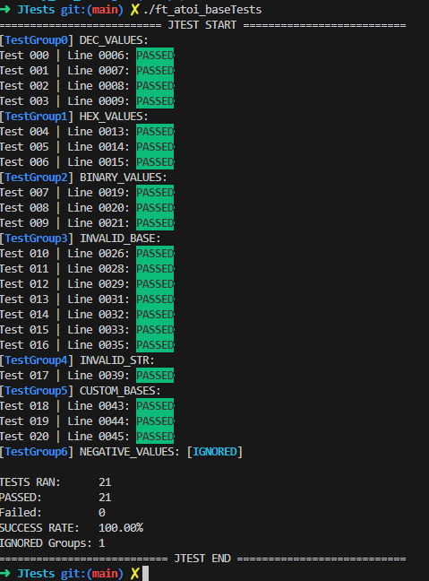
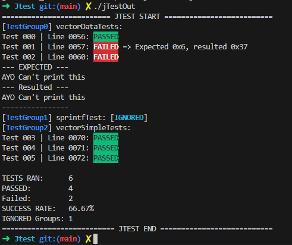

```
     ██╗██╗   ██╗███████╗████████╗              ████████╗███████╗███████╗████████╗
     ██║██║   ██║██╔════╝╚══██╔══╝              ╚══██╔══╝██╔════╝██╔════╝╚══██╔══╝
     ██║██║   ██║███████╗   ██║       █████╗       ██║   █████╗  ███████╗   ██║   
██   ██║██║   ██║╚════██║   ██║       ╚════╝       ██║   ██╔══╝  ╚════██║   ██║   
╚█████╔╝╚██████╔╝███████║   ██║                    ██║   ███████╗███████║   ██║   
 ╚════╝  ╚═════╝ ╚══════╝   ╚═╝                    ╚═╝   ╚══════╝╚══════╝   ╚═╝   
```
Just-Test or Jt for short is your test-harness made in C for C, with the goal of making it as easy as possible for C devs to integrate unit testing and test-driven development(TDD) into their workflow.

## *Summary*:
* [How to Build and Use](#How-to-Build-and-Use)
* [General Structure of a Test file](#general-structure-of-a-test-file)
* [Test Groups](#test-groups)
* [Assertions](#assertions)
* [Additional Features](#additional-features)
* [Contributing](#contributing)
* [Examples](#Examples)
* [Header](#1.1)
## > *How to Build and Use*:
 - you can either build the library to use everywhere in the future:
   ```bash
   $> make lib
   $> gcc -o Test MyTestFile.c jt.a
   ```
- Or you can compile it using the makeFile:
  ```bash
    >> change FILE=<path_to_your_file>
    $> make
  ```
- BONUS:
     - you can directly override variables in the makeFile like this:
   ```bash
   $> make FILE=<path_to_your_file>
   ```
     - Check [LIBASM](https://github.com/Ayg0/LIBASM) where I did add Tests for under the Linux Section.
## > *Structure of a Test file*:
  - Your test file must Contain:
      - main with at leats `JTEST_START` and `JTEST_END`, which defines the block where you call the tests.
      - You can call induvial TestGroups Using `runTest`(<testGroup>); or run all tests using `runAll`();
      - A definition of `Jsetup`() and `Jcleanup`(), you can leave them empty if you don't need them.
  - your test file can have multiple testGroups declared.
  - Multiple Assertions to make sure everything works well.
## > *Test Groups*:
  - If you Assertions are for the same purpose consider Grouping them under a TestGroup.
  - Here is a declaration example ensuring the output of the add function:
      ```C
        TEST_START(AddOutputChecks)
          ASSERT_INT32_EQU(3, add(1,2));
          ASSERT_INT32_EQU(-5, add(6, -11));
        TEST_END
      ```
  - TestGroups can be flaged to be ignored and not ran by JTEST, using the optional param `IGNORE_TEST`:
      ```C
        TEST_START(AddOutputChecks, IGNORE_TEST)
          ASSERT_INT32_EQU(3, add(1,2));
          ASSERT_INT32_EQU(-5, add(6, -11));
        TEST_END
      ```
## > *Assertions*:
  - Assertions are your building blocks, they support all generic types for example:
      ```C
          ASSERT_UINT32_EQU(3, add(1,2));
          ASSERT_INT32_EQU(-5, add(6, -11));
          ASSERT_FLOAT_EQU(3.14, PI);
      ```
  - And also supports some useful formats, and types for example:
     ```C
          ASSERT_HEX_EQU(0x45, 0x43);
          ASSERT_STR_EQU("Hello", s);
      ```
  - you can also test your own types using `ASSERT_DATA_EQU` for example:
    ```C
        /*More Information Available in the TestExamples.c*/
        typedef struct vector{
          int x;
          int y;
        } _vector;

        _vector v1 = {.x = 0, .y = 6};
        _vector v2 = {.x = 0, .y = 6};
        ASSERT_DATA_EQU(&v1, &v2, cmpVector, printVector);
    ```
## > *Additional Features*:
  **=>** Jtest Work on the Standard Error By default making it easier to dump it's output to a log file.  
  **=>** Jtest offers a No-Colors mode to make it well presented in a log file where colors will not show up (check Makefile).
## > *Contributing*:
  Contributions are very welcome! Feel free to open issues or pull requests for bug fixes, improvements, or new features.

## [1.1]<a id='1.1'></a>
## > *Examples*:
| atoiBase | jtestExample |
|---|---|
|  |  |
